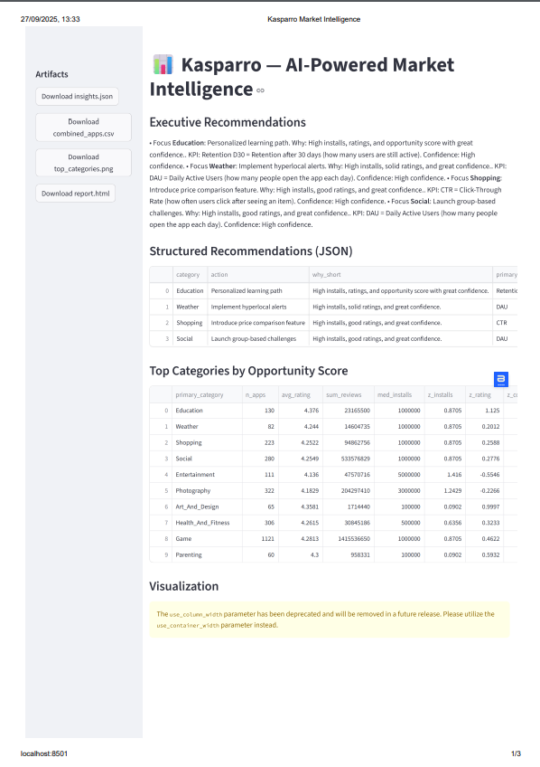
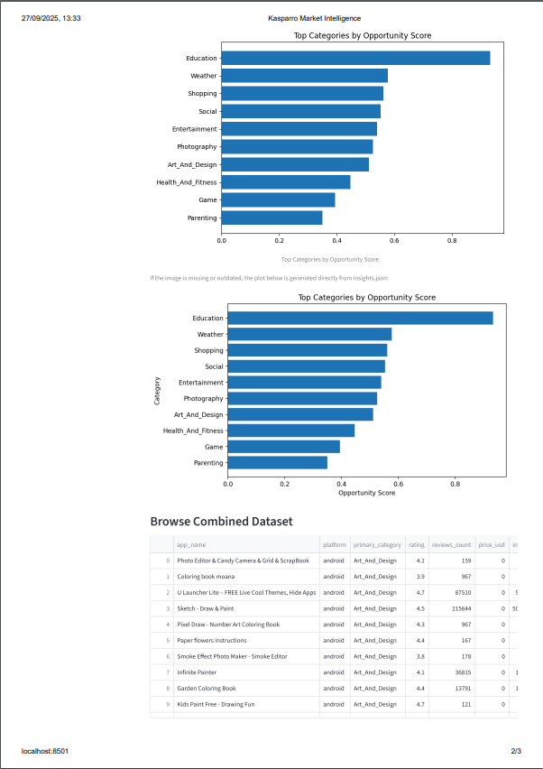
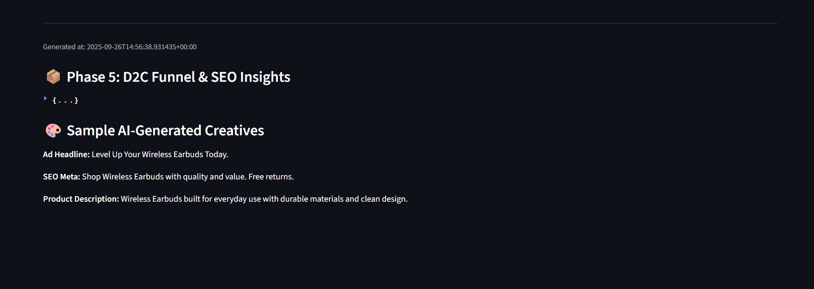
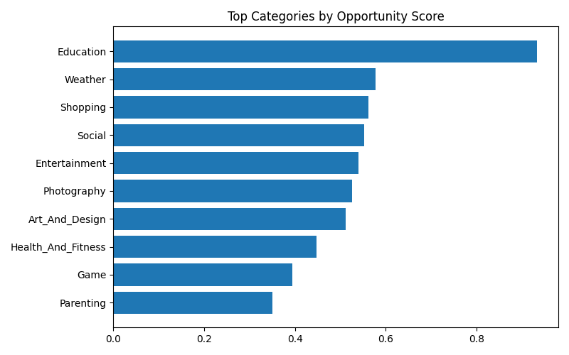

# 📊 Kasparro --- AI-Powered Market Intelligence

**Author:** Viresh Nagouda

---

## 🚀 Project Overview

This project was developed as part of the **Applied AI Engineer
assignment at Kasparro**.\
It demonstrates how to build an **end-to-end market intelligence
pipeline** that:

- Cleans & unifies **Google Play (Kaggle dataset)** and **Apple App
  Store (iTunes API / RapidAPI)** data\
- Computes an **opportunity score** for app categories, balancing
  installs, ratings, and competition\
- Generates **confidence scores** to assess reliability of insights\
- Produces stakeholder-friendly outputs:
  - `combined_apps.csv` → unified dataset\
  - `insights.json` → structured insights\
  - `report.html` → executive summary (with Gemini AI
    recommendations)\
  - `app.py` → Streamlit app for exploration\
  - (Optional) `phase5_d2c_insights.json` → D2C funnel, SEO, and
    creatives

---

## 📂 Repository Structure

    kasparro-market-intel/
    │── kasparrodatapipeline.ipynb   # Full Kaggle notebook pipeline
    │── combined_apps.csv            # Unified app dataset
    │── insights.json                # Top categories + summary
    │── report.html                  # Executive HTML report
    │── app.py                       # Streamlit interactive app
    │── phase5_d2c_insights.json     # (Optional) D2C funnel + creatives
    │── README.md                    # Project documentation

---

## 🧹 Pipeline Steps

1.  **Data Ingestion**
    - Load Google Play dataset from Kaggle
      (`lava18/google-play-store-apps`)\
    - Enrich with Apple App Store data (via iTunes API / RapidAPI /
      mock fallback)
2.  **Cleaning & Unification**
    - Normalize installs, prices, sizes, categories\
    - Merge Android + iOS apps into a single schema
3.  **Analytics Layer**
    - Compute _opportunity score_:\
      \\(0.5 \* z_installs + 0.4 \* z_rating + 0.1 \*
      z_competition\\)\
    - Compute _confidence score_: scaled by app counts + rating
      variance
4.  **AI-Powered Insights**
    - Use **Google Gemini (via AI Studio)** to generate crisp,
      executive recommendations\
    - Fallback heuristics if no API key is provided
5.  **Outputs**
    - Save results to **CSV**, **JSON**, **HTML**\
    - Build a lightweight **Streamlit app** for interactive
      exploration

---

## 📊 Example Output (Top Categories)

- **Education** → High confidence, balanced installs, excellent
  ratings\
- **Weather** → Consistently high installs, low competition\
- **Shopping** → Strong retention, moderate opportunity\
- **Entertainment** → Large user base, but competitive\
- **Photography** → Niche but strong engagement

---

## 🖥️ Streamlit App (Local Run)

To explore interactively:

```bash
pip install streamlit pandas
streamlit run app.py
```

---

## 📸 Screenshots

### Executive Report (HTML Export)





[📄 View full PDF screenshot](screenshots/ScreenshotHTMLReport.pdf)

### Streamlit Dashboard



---

## ⚡ Phase 5 (Optional Extension)

The Phase 5 module analyzes **Direct-to-Consumer (D2C) funnels**, **SEO
data**, and generates **AI-powered creatives** (ad headlines, SEO meta,
product descriptions).\
Outputs are stored in `phase5_d2c_insights.json`.

---

## 📌 Key Learnings

- Cleaning messy app store data into a unified schema\
- Designing interpretable scoring methods for market opportunity\
- Using LLMs (Gemini) for stakeholder-facing summaries and creatives\
- Exporting insights in multiple **formats tailored to different
  audiences**

---

## 🏆 Deliverables

- 📄 Notebook: `kasparrodatapipeline.ipynb`\
- 📊 Unified dataset: `combined_apps.csv`\
- 📑 Insights JSON: `insights.json`\
- 📈 Report: `report.html`\
- 🖥️ Streamlit app: `app.py`\
- 🎯 (Optional) D2C extension: `phase5_d2c_insights.json`

---

## 📬 Contact

**Viresh Nagouda**\
Applied AI Engineer \| Cloud, IoT & AI/ML Enthusiast
